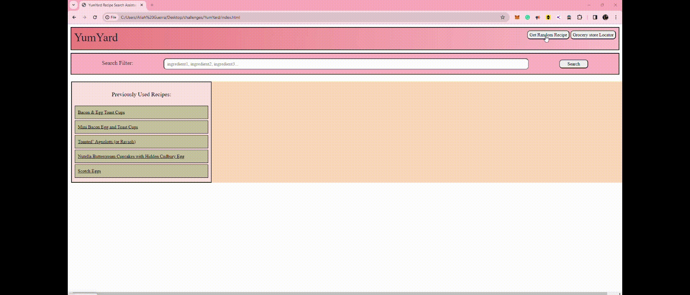

# YumYard

## Description
Humans need to eat, but deciding what to cook every day, missing ingredients, and/or having a long day can make the thought of preparing dinner overwhelming.
YumYard is a recipe search assistant website designed to give people ideas of what to cook at the push of a button.
It's perfect for Working professionals, students, homemakers, chefs, and even kids! Using HTML, CSS, Javascript code, and 2 server-side APIs, the recipes can be generated randomly or based on the user's specific ingredients. If the user is missing a few key ingredients, there's also a handy button that locates the nearest grocery store based on the user's current location. Any previously searched/visited recipe links are saved to the home page, so when the user returns to YumYard, all of those links can be easily revisited without searching again.

## Table of contents
- [Installation](#installation)
- [Screenshot](#screenshot)
- [Features](#features)
- [Usage](#usage)
- [credits](#credits)
- [License](#license)
- [Contributing](#contributing)
- [Testing](#Testing)

## Installation

To install this project git clone https://github.com/AliahG97/YumYard.git

## Screenshot

## Features
-Random Recipe Generator: The recipe is using an API from Snoonacular to display random recipes from its library when the user clicks the 'Random Recipe' button.

-Recipe Search Filter Ingredients: The recipe is using an API from Snoonacular to display recipes from its library based on the ingredients entered into the search input by the user and when they click the 'Search' button.

-Recent Recipes: When the user clicks any of the hyperlinks (underlined or in blue) inside of the recipe descriptions, they will automatically be added to the 'previously viewed recipes' and saved to the local storage. Upon clicking the links in the green boxes, it will bring the user back to the full recipe page on Spoonacular's website. When the page is refreshed or the user returns to YumYard, the list of searches will remain displayed until local storage is reset and cleared.

-Store Locator: The store locator is an anchored link within a button that goes to a pre-filled Google Maps search of 'grocery store' so that when the user clicks the button, it will add in the user's longitude and latitude to then provide a list of the nearest grocery stores currently open.

## Usage
Working professionals and/or student typically has early mornings, fast-paced routines, long hours at work or school, trying to maintain a healthy diet, and going to bed at a reasonable hour isn't easy, a bit of time to cook to eat healthy, but not enough time or energy to think about what to cook for dinner every day. The user can enter the main ingredients they Want to use, for example, chicken, rice, and broccoli. 10 options of meals that include rice broccoli and chicken. If they are missing ingredients, they can search for more ingredients to make it more specific to the ingredients they already have. The alternative is to click the grocery store locator button and find the nearest open grocery store for the missing ingredients.

Homemakers, chefs, who cook frequently and sometimes just want to try something new or kids just looking for a fun baking activity can use the "get random recipe" and select 1 out of the 10 that will populate. Once the Recipe is selected, the user will click the locate grocery store button to find the nearest grocery store as most users won't already have all the ingredients of the random recipe they selected.

## Credits

Aliah Guerra: HTML, CSS, Random Recipe API (javascript), store locator button, and README.md
Ryan Walker: Ingredients list API (javascript and CSS styling) & recent recipe local Storage.
GitHub: Save repository, collaboration, version control, task management, and webpage deployment.
HTML: Basic structure of the web page, and store locator button
CSS: Style for webpage and all details
Java Script: functionality of webpage and APIs
Spoonacular Server-side API: The recipes Library where all the recipes are being pulled from.

https://spoonacular.com/food-api

## License
Creative Commons License
© YumYard by Aliah Guerra & Ryan Walker 2023. Confidential and Proprietary. All Rights Reserved.

## Contributing

- Unlimited tokens to call the APIs would be amazing because we originally wanted to make the random recipes display one per 'click' on the 'Random Recipes' button, so they can click/call the API again each time, but we keep running out of tokens, so we decided to display 10 results per API call so that if the user doesn't link it they can just look at the next recipe on the list.

- Use the MealMe API instead of a Google Link to automate the search specifically for the ingredient the user is missing so they know where they can buy it.

- Possibly integrate Uber Eats (if they have an API) so that the users can order the missing ingredients and have them delivered. They can also just have a meal delivered as well if they decide what to eat but are simply too tired to prepare it themselves.

- Set up the vegan Spoonacular API to indicate vegan-friendly options and in vegan substitutes for traditionally non-vegan recipes.

## Tests

1. Run the Index HTML in the browser, and click the 'Get random recipe' button. It should automatically populate 10 random recipes in the display.

2. Then try searing for multiple ingredients in the format of the ingredient followed by a comma and then a space,(ie: Ingr1, Ingr2, Ingr3...). 

3. If either of these buttons is not working open the inspector. 

4. check the console to see what the error code is.

5. If the Error code is 402, note that there are no more payment tokens to call the APIs, wait until they refill in 24 hours.

6. Or if you need to continue using the API for development purposes, create another Spoonacular API account to get another API Key, and then comment out the existing APIKeys in the Javascript, and paste in the new API key so that the new key is the only uncommented key.

7. Repeat this step or uncomment a different API in the Javascript (given the tokens have been refilled).